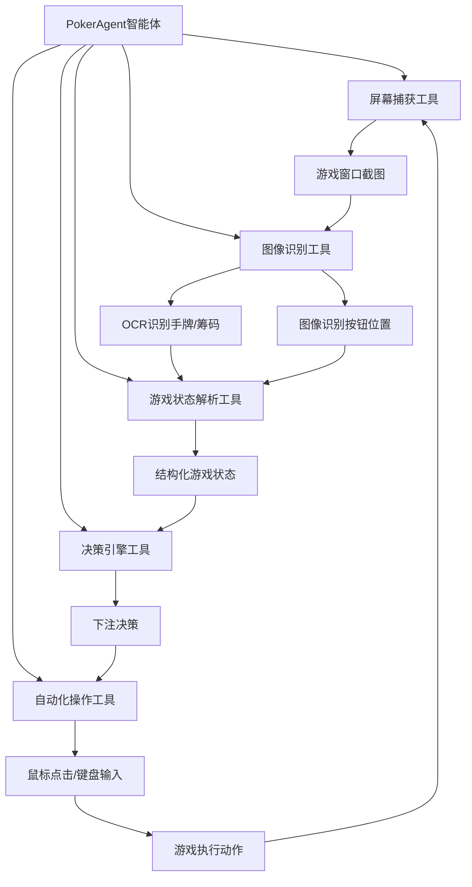

# 德州扑克

自动下注机器人开发计划

## 项目概述

开发一个基于 OpenManus 框架的桌面德州扑克自动下注机器人，能够实时识别游戏状态并自动做出下注决策。

## 架构设计




## 实现步骤

### 阶段一：核心工具开发

#### 1. 屏幕捕获工具 (`app/tool/poker_screen_capture.py`)

- 功能：捕获指定游戏窗口的截图

- 实现：

- 使用 `mss` 或 `pyautogui` 捕获屏幕

- 支持窗口标题匹配和区域选择

- 返回 base64 编码的截图

- 参考：[app/tool/browser_use_tool.py](app/tool/browser_use_tool.py) 的截图功能

#### 2. 图像识别工具 (`app/tool/poker_image_recognition.py`)

- 功能：识别游戏界面中的关键元素

- 实现：

- 使用 OCR（`pytesseract` 或 `easyocr`）识别文字（手牌、筹码、按钮文字）

- 使用模板匹配或深度学习识别扑克牌

- 识别按钮位置（下注、加注、弃牌等）

- 返回：识别结果的结构化数据

#### 3. 游戏状态解析工具 (`app/tool/poker_state_parser.py`)

- 功能：将识别结果解析为结构化游戏状态

- 实现：

- 解析手牌（两张底牌）

- 解析公共牌（翻牌、转牌、河牌）

- 解析筹码数量（底池、自己的筹码、对手筹码）

- 解析位置信息（按钮位置、自己的位置）
- 解析行动历史

- 返回：`PokerGameState` 对象

#### 4. 决策引擎工具 (`app/tool/poker_decision_engine.py`)

- 功能：基于游戏状态做出下注决策

- 实现：

- 手牌强度评估（使用 `pypokerengine` 或自定义算法）

- 胜率计算（基于手牌和公共牌）

- 位置策略（根据位置调整策略）

- 对手分析（记录对手行为模式）

- 资金管理（根据筹码深度调整策略）

- 返回：决策结果（弃牌/跟注/加注/全押 + 金额）

#### 5. 自动化操作工具 (`app/tool/poker_automation.py`)

- 功能：执行下注操作

- 实现：

- 使用 `pyautogui` 或 `pynput` 模拟鼠标点击

- 点击下注按钮（跟注、加注、弃牌等）

- 输入下注金额（键盘输入）
- 等待操作完成

- 参考：[app/tool/computer_use_tool.py](app/tool/computer_use_tool.py) 的鼠标键盘操作

### 阶段二：数据模型定义

#### 6. 游戏状态模型 (`app/schema.py` 扩展)

- 定义 `PokerGameState` 类：

  ```python
    class PokerGameState(BaseModel):
        hand_cards: List[str]  # 底牌，如 ["As", "Kh"]
        community_cards: List[str]  # 公共牌
        pot: int  # 底池
        my_chips: int  # 我的筹码
        opponent_chips: Dict[str, int]  # 对手筹码
        position: str  # 位置（BTN, SB, BB, UTG等）
        action_history: List[str]  # 行动历史
        current_bet: int  # 当前下注额
        min_raise: int  # 最小加注额
  ```


#### 7. 决策结果模型

- 定义 `PokerDecision` 类：
  ```python
    class PokerDecision(BaseModel):
        action: Literal["fold", "call", "raise", "all_in"]
        amount: Optional[int]  # 加注金额（如果是加注）
        confidence: float  # 决策置信度
        reasoning: str  # 决策理由
  ```


### 阶段三：智能体开发

#### 8. 德州扑克智能体 (`app/agent/poker_agent.py`)

- 继承 `ToolCallAgent`

- 实现游戏循环：

1. 捕获屏幕

2. 识别游戏状态

3. 解析状态

4. 做出决策

5. 执行操作

6. 等待下一轮

- 配置：

- 系统提示词：定义扑克策略和规则

- 工具集合：包含所有扑克相关工具

- 最大步数：根据游戏节奏调整

#### 9. 提示词模板 (`app/prompt/poker.py`)

- 系统提示词：包含德州扑克规则、策略指导

- 下一步提示词：引导智能体分析当前状态并做出决策

### 阶段四：主程序入口

#### 10. 启动脚本 (`poker_main.py`)

- 创建 `PokerAgent` 实例

- 配置游戏窗口识别参数
- 启动游戏循环

- 支持命令行参数（窗口标题、策略模式等）

### 阶段五：高级功能（可选）

#### 11. 对手分析模块 (`app/tool/poker_opponent_analysis.py`)

- 记录对手行为模式

- 分析对手风格（紧/松、激进/保守）

- 根据对手调整策略

#### 12. 统计和日志 (`app/utils/poker_stats.py`)

- 记录游戏统计（胜率、盈利等）
- 保存游戏日志

- 生成分析报告

## 技术栈

- **屏幕捕获**：`mss`, `pyautogui`

- **图像识别**：`pytesseract`, `easyocr`, `opencv-python`

- **扑克牌识别**：模板匹配或 YOLO 等目标检测模型

- **自动化操作**：`pyautogui`, `pynput`

- **扑克算法**：`pypokerengine`（可选，或自定义实现）

- **窗口管理**：`pywin32` (Windows) 或 `pyobjc` (macOS)

## 文件结构

```javascript
app/
├── tool/
│   ├── poker_screen_capture.py      # 屏幕捕获工具
│   ├── poker_image_recognition.py   # 图像识别工具
│   ├── poker_state_parser.py        # 状态解析工具
│   ├── poker_decision_engine.py     # 决策引擎工具
│   ├── poker_automation.py          # 自动化操作工具
│   └── poker_opponent_analysis.py   # 对手分析工具（可选）
├── agent/
│   └── poker_agent.py               # 德州扑克智能体
├── prompt/
│   └── poker.py                     # 扑克提示词模板
├── utils/
│   └── poker_stats.py               # 统计工具（可选）
└── schema.py                        # 扩展数据模型

poker_main.py                        # 主程序入口
```


## 注意事项

1. **法律和道德**：确保使用符合相关法律法规和平台服务条款

2. **准确性**：图像识别需要高准确率，可能需要针对特定游戏界面优化

3. **性能**：实时识别需要优化性能，避免延迟影响决策

4. **错误处理**：需要完善的错误处理和恢复机制

5. **测试**：需要充分的测试，包括不同游戏界面和场景

## 开发优先级

1. **P0（核心功能）**：屏幕捕获、基础图像识别、简单决策、自动化操作

2. **P1（重要功能）**：完整状态解析、高级决策引擎、智能体集成