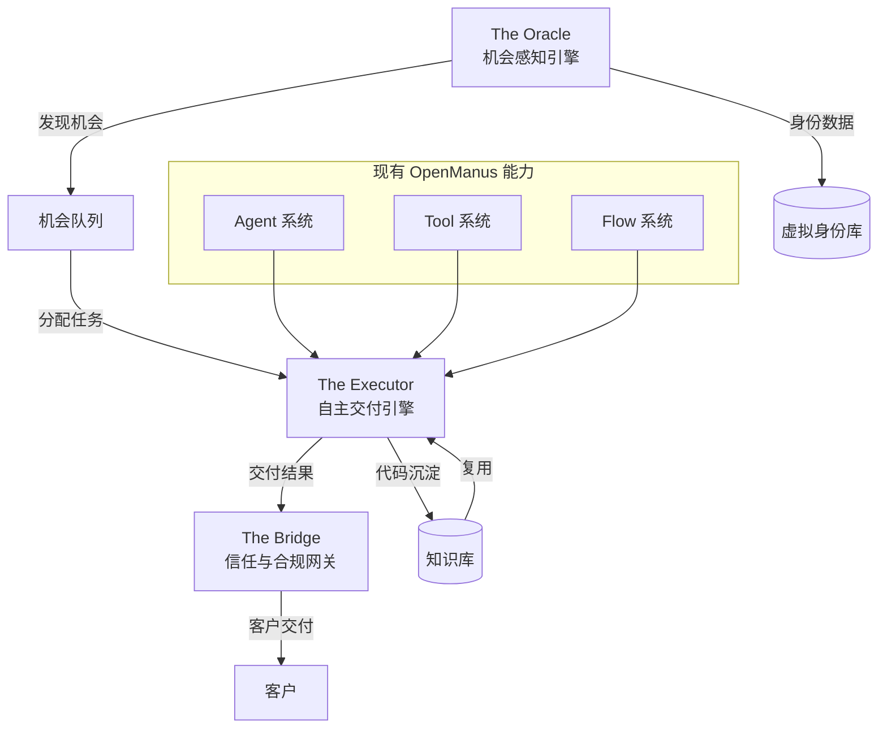

#

AI 数字员工平台实施计划

## 一、系统架构设计

### 1.1 整体架构

系统在 OpenManus 基础上扩展，新增三个核心子系统：

```javascript
OpenManus (现有基础)
├── app/
│   ├── oracle/              # The Oracle - 机会感知引擎
│   │   ├── scraper/         # 抓取模块
│   │   ├── analyzer/        # 意图理解模块
│   │   └── identity/        # 虚拟身份管理
│   ├── executor/            # The Executor - 自主交付引擎
│   │   ├── workflow/        # 工作流引擎
│   │   ├── knowledge/       # 知识沉淀库
│   │   └── quality/          # 质量保证模块
│   └── bridge/              # The Bridge - 信任与合规网关
│       ├── translation/     # 多语种中继
│       └── finance/          # 财务系统
```


### 1.2 数据流设计




## 二、子系统详细设计

### 2.1 The Oracle (机会感知引擎)

**核心功能**:

- 多平台招聘信息抓取 (Upwork, Toptal, LinkedIn, Twitter/Discord)

- LLM 驱动的意图理解和匹配度分析

- 虚拟身份信用矩阵构建

**技术实现**:

- 基于现有 `BrowserUseTool` 的浏览器自动化

- API 劫持模块 (使用 Playwright 网络拦截)

- 向量数据库存储职位信息 (Chroma)

- LLM 分析工具 (复用现有 LLM 接口)

**关键文件**:

- `app/oracle/scraper/base.py` - 抓取器基类

- `app/oracle/scraper/upwork_scraper.py` - Upwork 抓取器

- `app/oracle/scraper/linkedin_scraper.py` - LinkedIn 抓取器

- `app/oracle/analyzer/intent_analyzer.py` - 意图分析器

- `app/oracle/identity/identity_manager.py` - 身份管理器

- `app/oracle/oracle_agent.py` - Oracle 智能体

### 2.2 The Executor (自主交付引擎)

**核心功能**:

- 端到端代码生成工作流

- 自动化测试和 Bug 修复

- 知识沉淀和复用

**技术实现**:

- 基于现有 `PlanningFlow` 扩展工作流引擎

- 集成 `SWEAgent` 进行代码生成

- 向量数据库 (Chroma) + 文件系统存储代码库

- 自动化测试工具集成

**关键文件**:

- `app/executor/workflow/delivery_workflow.py` - 交付工作流

- `app/executor/knowledge/knowledge_base.py` - 知识库管理

- `app/executor/knowledge/vector_store.py` - 向量存储

- `app/executor/quality/test_runner.py` - 测试运行器

- `app/executor/executor_agent.py` - Executor 智能体

### 2.3 The Bridge (信任与合规网关)

**核心功能**:

- 实时语音克隆和多语种中继

- 财务系统集成 (Stripe/Mercury API)

- 合规性检查

**技术实现**:

- 语音合成 API (如 ElevenLabs) 集成

- 实时翻译服务 (DeepL/Google Translate API)

- 财务 API 集成工具

**关键文件**:

- `app/bridge/translation/voice_clone.py` - 语音克隆

- `app/bridge/translation/translator.py` - 翻译服务

- `app/bridge/finance/payment_processor.py` - 支付处理

- `app/bridge/bridge_agent.py` - Bridge 智能体

## 三、90 天实施计划

### 第一阶段：基建与冷启动 (Day 1-30)

**Week 1-2: 基础设施搭建**

- [ ] 创建三个子系统的目录结构

- [ ] 设计数据模型和 Schema (`app/schema.py` 扩展)

- [ ] 配置向量数据库 (Chroma) 集成

- [ ] 设计配置管理 (`config/config.toml` 扩展)

**Week 3-4: The Oracle MVP**

- [ ] 实现基础抓取器 (`app/oracle/scraper/base.py`)

- [ ] 实现 Upwork 抓取器 (浏览器自动化)

- [ ] 实现意图分析器 (`app/oracle/analyzer/intent_analyzer.py`)

- [ ] 创建 Oracle Agent (`app/oracle/oracle_agent.py`)

- [ ] 实现虚拟身份管理器基础功能

**交付物**: 能够抓取 Upwork 职位并分析匹配度的 MVP

### 第二阶段：单点突破与盈利闭环 (Day 31-60)

**Week 5-6: The Executor MVP**

- [ ] 扩展 `PlanningFlow` 为交付工作流

- [ ] 实现知识库系统 (`app/executor/knowledge/`)

- [ ] 集成代码生成和测试自动化

- [ ] 实现代码质量检查模块

**Week 7-8: The Bridge MVP + 集成测试**

- [ ] 实现基础翻译功能 (`app/bridge/translation/`)

- [ ] 集成支付 API (Stripe 测试环境)

- [ ] 三个子系统集成测试

- [ ] 端到端流程验证

**交付物**: 完整的"抓取-分析-交付-结汇"闭环 MVP

### 第三阶段：规模化压测与资产化 (Day 61-90)

**Week 9-10: 多平台扩展**

- [ ] 扩展抓取器支持 LinkedIn, Toptal

- [ ] 优化意图分析准确度

- [ ] 增强知识库检索能力

**Week 11-12: API 化和 SaaS 准备**

- [ ] 设计 REST API 接口 (`app/api/`)

- [ ] 实现订阅管理系统

- [ ] 性能优化和压测

- [ ] 文档和部署脚本

**交付物**: 可对外提供 API 服务的完整系统

## 四、关键技术实现细节

### 4.1 混合抓取方案

```python
# app/oracle/scraper/base.py
class BaseScraper:
    async def scrape(self, url: str) -> JobPosting:
        # 1. 尝试 API 方式
        if await self._try_api_scrape(url):
            return result
        # 2. 回退到浏览器自动化
        return await self._browser_scrape(url)
```


### 4.2 混合知识库

```python
# app/executor/knowledge/knowledge_base.py
class KnowledgeBase:
    def __init__(self):
        self.vector_store = ChromaDB()  # 语义搜索
        self.file_store = FileSystemStore()  # 完整代码库
    
    async def search(self, query: str) -> List[CodeSnippet]:
        # 向量搜索找到相关代码
        candidates = await self.vector_store.search(query)
        # 从文件系统加载完整代码
        return [self.file_store.load(c.id) for c in candidates]
```


### 4.3 工作流引擎扩展

基于现有 `PlanningFlow`，扩展为交付专用工作流：

```python
# app/executor/workflow/delivery_workflow.py
class DeliveryWorkflow(PlanningFlow):
    async def execute_delivery(self, job_requirement: str):
        # 1. 分析需求
        # 2. 搜索知识库
        # 3. 生成代码
        # 4. 运行测试
        # 5. 修复 Bug
        # 6. 提交代码
```


## 五、依赖和配置

### 5.1 新增依赖

在 `requirements.txt` 中添加:

- `chromadb` - 向量数据库

- `elevenlabs` - 语音合成 (可选)

- `stripe` - 支付处理

- `deepl` - 翻译服务 (可选)

### 5.2 配置扩展

在 `config/config.toml` 中添加:

```toml
[oracle]
chroma_path = "workspace/oracle_db"
scrapers = ["upwork", "linkedin"]

[executor]
knowledge_base_path = "workspace/knowledge_base"
vector_db_path = "workspace/vector_db"

[bridge]
stripe_api_key = ""
translation_provider = "deepl"
```


## 六、测试策略

- 单元测试: 每个模块独立测试

- 集成测试: 三个子系统协作测试

- 端到端测试: 完整流程验证

- 性能测试: 并发抓取和交付能力

## 七、风险与缓解

1. **抓取被封禁**: 实现代理池和请求限流

2. **代码质量不稳定**: 增强测试覆盖和人工审核流程

3. **API 成本过高**: 实现缓存和批量处理优化

4. **合规风险**: 实现合规检查模块和审计日志

## 八、成功指标

- **The Oracle**: 每天抓取 100+ 职位，匹配准确率 >80%

- **The Executor**: 代码生成成功率 >70%，测试通过率 >90%

- **The Bridge**: 翻译准确率 >95%，支付成功率 >99%